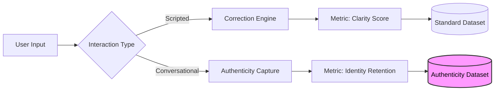

# Case Study: The "Authenticity" Data Moat
### Solving the "Corporate Tone" in AI Voice Generation

  

> **Subject:** BoldVoice (Series A Analysis)
> **Role:** Data Product Strategy & Infrastructure Analysis
> **Theme:** Identity-Preserving AI Infrastructure

---

## 1. Executive Summary
The Generative AI landscape currently faces a crisis of **"Stylistic Homogenization."**

When we use LLMs to polish communication or generate audio, the result is often "Perfect but Generic." The algorithms strip away unique human quirks, hesitation patterns, and phrasing, replacing them with a statistically average, robotic persona.

While analyzing **BoldVoice** (an accent coaching app), I identified a massive, latent **Data Asset.** By successfully teaching users the American accent, they are sitting on the potential to capture the rarest dataset in AI: **High-Fidelity American English that retains the unique personality of the speaker.**

This case study explores how a successful EdTech product can extend its data capture from "Scripted Practice" to "Natural Conversation," becoming the critical infrastructure layer needed to make AI sound like *us*, not bots.

---

## 2. The Current State: "Correction as a Service"
BoldVoice has successfully found product-market fit by gamifying the "American Accent." They address a tangible user pain point: the fear of professional exclusion due to a lack of clarity.

| Component | Description |
| :--- | :--- |
| **User Goal** | "I want to be understood clearly." |
| **Mechanism** | Scripted practice, phoneme-level feedback, and deterministic scoring against a "Native Speaker" baseline. |
| **Data Asset** | High-fidelity recordings of users mimicking a standardized, formal template. |

### The Limitation: Formal Determinism
The current dataset is bounded by the nature of the training: **Scripted Prosody.**

Because the platform focuses on professional scenarios (e.g., *"Negotiate a Salary"*), the data captures how people *read* or *perform*, not how they *converse.* While this achieves the primary goal of "Clarity," it results in a dataset that is polished but fundamentally guarded.

---

## 3. The Data Gap: The "Uncanny Valley" of Text
As millions of professionals turn to LLMs to draft emails or correct grammar, they are discovering a new problem: **The Output Gap.**

* ❌ **Input:** Authentic but broken English.
* ❌ **Output:** Grammatically perfect but robotic "Corporate Speak."

The industry is missing the middle ground. There is currently no large-scale dataset that combines **Grammatical Precision** with **Spontaneous Cognitive Flow** (the natural pauses, enthusiasm, and sentence structures that make us human).

---

## 4. The Strategic Horizon: The "Authenticity" Asset
To bridge this gap, BoldVoice is uniquely positioned to capture a new class of training data.

### The Extension: From Performance to Flow
BoldVoice has already solved the hardest challenge: ensuring users speak with correct grammar and clear pronunciation. The opportunity lies in extending this capture to **"Natural Flow."** By moving users from high-stakes scripts to low-stakes, unscripted conversation, the platform can capture the essence of the user's personality.

### The Target Data Class
This creates a proprietary dataset that no other platform possesses:

> **Target Data Class:** `[High-Fidelity American English] + [Spontaneous, Unscripted Cognitive Flow]`

This data proves that a speaker can be "American Sounding" (Clear) without being "Generic" (Robotic). It captures the "Human Spark", the specific way a person laughs, hesitates, or emphasizes a point, while maintaining the structural integrity of the language.

### Theoretical Architecture
*How the data pipeline evolves to support this new asset class.*

---

## 5. The Value Proposition (ROI)

#### 🤖 For the AI Industry (B2B Infrastructure)
Foundation Model providers (OpenAI, Google) are desperate to solve the "tone problem." BoldVoice owns the antidote. Instead of training models on audiobooks (which sound like narrators), they can train on this **"Authenticity Dataset"** to teach models that "Polished" does not have to mean "Sterile."

#### 👤 For the User (Personal Brand)
The end game is **Identity Preservation.**

> "When I use an AI tool to generate a voice message or draft a speech, I don't want it to sound like a PR release. I want it to have **Executive Presence** (Polished) but still sound like **Me** (Authentic)."

---

## 6. Conclusion
BoldVoice has mastered **Clarity** (The Accent).
Their next massive opportunity is **Authenticity** (The Data).

By expanding their data capture beyond the "Boardroom" and into the "Living Room" of human conversation, they can capture the full spectrum of human expression, securing their place not just as an EdTech leader, but as a cornerstone of the Generative AI infrastructure.

---
*[Back to Business Cases](../business-cases)*
